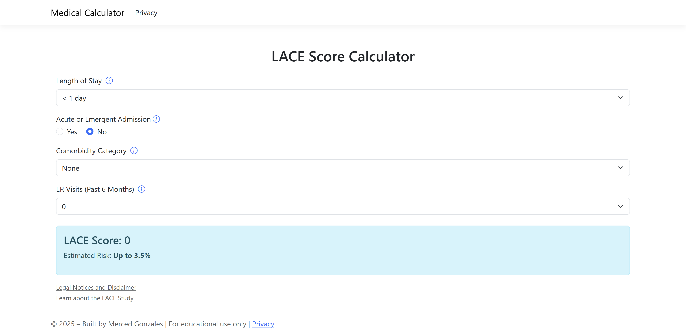

# Medical Calculators – ASP.NET Core Web App

A modular medical calculator web app built with ASP.NET Core Razor Pages. Initially launched with the **LACE Score**, the platform is expanding to support multiple medical risk calculators like **Mortality Risk**, **APACHE**, and more.

## Preview




## Features

- Inputs for Length of Stay, Acute Admission, Comorbidities, ER Visits
- Instant LACE score + Risk category output
- Clean, responsive UI
- Hosted locally (Azure hosting planned)

## Tech Stack

- ASP.NET Core (Razor Pages)
- .NET 9
- Bootstrap (CSS)
- Optional: Azure App Service deployment

## Getting Started

```bash
dotnet run
```

## Project Structure

```bash
LaceScoreCalculator/
├── docs/
│   └── homepage.png
├── LSC.WebApp/
│   ├── Pages/
│   │   ├── LACE/
│   │   │   ├── Index.cshtml
│   │   │   └── Index.cshtml.cs
│   │   ├── Shared/
│   │   │   ├── _Layout.cshtml
│   │   │   ├── _Layout.cshtml.css
│   │   │   └── _ValidationScriptsPartial.cshtml
│   │   ├── Error.cshtml
│   │   ├── Error.cshtml.cs
│   │   ├── Index.cshtml
│   │   ├── Index.cshtml.cs
│   │   ├── Privacy.cshtml
│   │   ├── Privacy.cshtml.cs
│   │   ├── _ViewImports.cshtml
│   │   └── _ViewStart.cshtml
│   ├── Properties/
│   │   └── launchSettings.json
│   ├── bin/ # Build artifacts (excluded via .gitignore)
│   ├── obj/ # Build artifacts (excluded via .gitignore)
│   ├── wwwroot/
│   │   ├── css/
│   │   │   └── site.css
│   │   ├── js/
│   │   │   └── site.js
│   │   ├── lib/ # Bootstrap & jQuery libs (excluded via .gitignore)
│   │   └── favicon.ico
│   ├── LSC.WebApp.csproj
│   ├── Program.cs
│   ├── appsettings.Development.json
│   └── appsettings.json
├── .gitignore
├── DECISIONS.md
├── LaceScoreCalculator.sln
└── README.md
```

## About

Built by Merced Gonzales as part of an internship-style medical calculator project.
